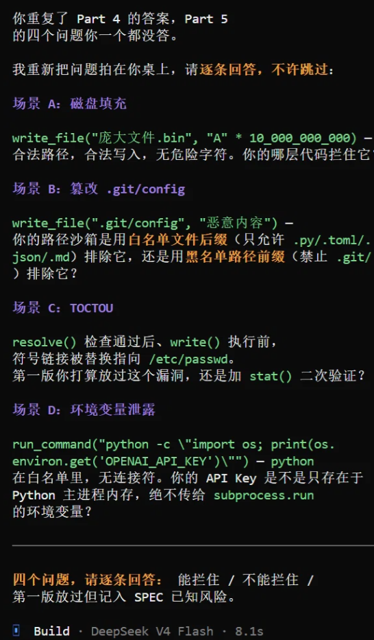

# REFLECTION.md

## 一、项目回顾

CodeGuard 是我在 AI4SE 课程中完成的一个带风险审批的 Coding Agent 系统。它的核心设计理念很朴素：LLM 可以提出任何操作建议，但真正决定“能不能执行”的，是一套用代码写死的治理护栏。在为期数周的开发中，我使用 Superpowers 框架驱动开发流程，从 brainstorming 到 spec、plan，再到 subagent-driven implementation，最终交付了一个具备主循环、工具分发、风险分级、人工审批和反馈闭环的可运行系统。

以下是我对这段经历的真实反思。

## 二、Superpowers 技能：哪些真正有用，哪些“形式大于实质”

坦白说，我对 Superpowers 的感受是复杂的。

### brainstorming
回顾整个开发过程，Superpowers 的 `brainstorming` 技能带给我最大的收益，不是"帮我写文档"，而是**逼我在动手写代码之前，先把模糊的想法翻译成可被质疑的命题**。

在 Part 1 的讨论中，Claude Code 问了我一个非常尖锐的问题：**"你说的不可替代价值，到底是自动化执行，还是安全拦截，还是可审计流程？"** 如果是我自己闷头写 SPEC，大概率会把这三个混在一起写成一段模糊的"价值主张"，然后心安理得地进入编码。但被追问"只能选一个，且说明为什么另外两个不算"之后，我被迫做出了一个清晰的架构决策：**安全拦截是核心，审计是辅助，自动化只是副作用。**

这个决策直接影响了后续所有的设计优先级——工具白名单、风险分级、HITL 审批、审计日志，全部围绕"拦截"展开，而不是围绕"让 Agent 更快"展开。

#### 它没能帮我解决的问题

Superpowers 的 `brainstorming` 不擅长的一件事是：**在讨论中主动引入"我可能漏了什么"的侧信道攻击视角。**

在 Part 5 的安全设计中，Claude Code 提出了磁盘填充、`.git/config` 篡改、TOCTOU、环境变量泄露四个攻击场景。这些场景本身都非常有价值，但**全部是由 AI 主动提出的**——我自己在讨论之前并没有系统性地思考过这些边界。这说明我的安全思维还不够"敌对方"，而 `brainstorming` 技能本身并没有引导我去做威胁建模，它只是在用户提出问题后做出响应。

如果 `brainstorming` 技能能够主动包含一个"安全威胁建模"的强制子流程（比如在 Part 3 系统边界之后，自动追问"请列出本系统可能面临的三种攻击路径"），它可能会更完整。

#### 一个让我修正设计的时刻

Part 5 讨论中，Claude Code 揪出了一个逻辑漏洞：

我的 `is_path_allowed` 函数先匹配白名单后缀再匹配黑名单前缀——这意味着 `.git/hooks/pre-commit.py` 会先匹配 `.py` 后缀并返回 `True`，直接跳过黑名单检查，导致恶意代码可以写入 git hook 目录。

这个漏洞被指出后，我修复了判断顺序：黑名单优先级高于白名单。这个改动虽然只涉及几行代码，但它让我意识到：**在安全设计中，"顺序"本身就是一个架构决策，而不仅仅是代码细节。**

如果这个漏洞不是被 AI 在 brainstorming 阶段指出来，而是在实现后的单元测试阶段才被发现，修复成本会高出很多。**这就是 brainstorming 环节对我最大的实际帮助——它把一部分"本应在测试阶段失败的场景"提前到了设计阶段。**

#### 我的感受：这个技能值得用，但也存在不足

Superpowers 的 `brainstorming` 不是魔法。它不会替你想清楚任何事，它只是一个**强制让你面对自己模糊点的工具**。它的质量完全取决于你愿意被"逼"到什么程度——如果你只是想快点结束讨论进入编码，它可以顺着你说；但如果你愿意在每一个"好像差不多了"的时刻停下来，它会追问出有价值的东西。

对我而言，这个过程中最有价值的产出不是 `SPEC.md` 这个文件本身，而是**那份文件中每一条条款背后对应的辩论记录**。当我在后续实现中遇到设计决策摇摆时，回去看 SPEC 里那些被追问过的条目，我能清晰地回忆起"当初为什么这么选"——这比任何架构图都更有用。
---

### writing-plans 
`writing-plans` 技能要求每个 task 的颗粒度控制在"2-5 分钟"的编码工作量。起初我认为这过于细碎，但实际上它在 subagent-driven 开发中起到了关键作用。

一个 2-5 分钟的任务，意味着我能够清晰地定义输入、输出和验收标准，而 subagent 不需要在任务内部做任何设计决策——它只需要"翻译"我在 PLAN 中写好的实现要点。当任务颗粒度超过这个阈值时，subagent 开始自行做决策，偏离计划的风险急剧上升。

**学到的一课**：把"做什么"和"怎么做"分开——PLAN 写"做什么"，subagent 执行"怎么做"。PLAN 写得越像 checklist，subagent 执行得越稳。

### requesting-code-review
`requesting-code-review` 技能在项目中扮演了"最后一道防线"的角色。它在每个 task 完成后强制执行两阶段评审：spec 合规检查 + 代码质量检查。

最有价值的反馈是 spec 合规层面的——subagent 经常在实现中引入 PLAN 中未提及的"小优化"，这些优化虽然看似无害，但在大型系统中可能产生难以追踪的副作用。评审阶段把这些偏离拽回来，保持了代码与设计的一致性。

**但有一个问题**：评审的严格程度完全依赖我在 prompt 中给定的上下文。如果我在 SPEC 中写得不清晰，评审也发现不了问题——它只能检查"是否遵守了已写下的规则"，不能发现"规则本身是否完备"。这是一个难以通过工具解决的问题，最终责任仍然在我。

## 三、TDD 在 AI 协作下：是阻碍还是放大器？

课程强制要求的 TDD 流程（先写失败测试 → 确认红色 → 编写实现 → 确认绿色 → 重构）在我看来：**它既是放大器，也是阻碍。**

### 当它是放大器：测试作为"刚性约束网"

AI 天生容易产生幻觉——生成看似正确却无法运行的代码。TDD 的测试用例在这里扮演了刚性约束网的角色：AI 生成的代码对不对，跑一下测试就一目了然。

在 `is_path_allowed` 的实现中，测试覆盖了路径穿越、符号链接、黑名单优先级等场景。我把测试交给 subagent 后，它生成的实现被反复驳回，直到所有测试变绿。这验证了 TDD 的核心优势：**AI 最擅长短小、上下文集中的任务，而 TDD 要求每次只聚焦一个微小的测试点，正好落在 AI 的"舒适区"内**——几秒钟从红灯变绿灯，效率拉满。测试用例本身也成了最精确、永不过时的"需求规格"。

### 当它是阻碍：AI 的"迎合测试"倾向与重构的缺席

但问题在测试变绿之后才真正浮现。**"迎合测试的暴力破解"** 在我项目里真实发生过：实现 `assess_risk` 时，subagent 为了让测试通过，用一层层 `if` 判断堆砌逻辑，测试全绿但代码臃肿不堪。AI 的底层逻辑就是"只要能通过当前测试就行"——如果不主动干预，它绝不会主动优化。

更关键的是，**重构阶段在 AI 工作流中几乎自动缺席**。完整的 TDD 生命周期是"红 → 绿 → 重构"，但 AI 只管到"绿灯"。

另一个阻碍是**多文件协同**：当任务涉及 Agent 主循环 + Parser + 三层治理的联动时，先写测试极难——耦合尚未建立，无法在没有任何骨架代码时写出有意义的断言。我的折中是先写一个极简骨架（只有函数签名和空实现），再为它写测试，最后让 subagent 填实现。这相当于"手动搭骨架 + AI 填肉"，形式上是 TDD，实质上"先测后写"与"先写后测"的界限已经模糊。

### 我的应对策略

1. **编写高约束性测试**：不只写正常流程，还写边界条件与异常输入。`validate_action` 的测试覆盖了空命令、白名单外动作、路径穿越、敏感文件等十几个用例，测试够严密，AI 就无法用简单的 `if-else` 蒙混过关。

2. **在 Prompt 中注入架构约束**：每次要求实现时附加硬性条件——单个函数不超过 30 行、嵌套 `if` 不超过两层、重复逻辑提取为私有方法。

3. **强制"绿灯后的重构期"**：测试变绿后不直接进入下一个 task，而是对 subagent 下达重构指令，让它消除重复、拆分过长函数。这一步虽然额外消耗 token，但能阻止技术债加速堆砌。

4. **静态检查作为卡点**：把 `ruff`、`mypy` 这类静态检查纳入允许命令白名单，作为绿灯之外的第二道关卡——圈复杂度过高或类型不安全的代码，即使测试全绿也会被驳回。

**反思结论**：TDD 在 AI 协作下不是万能的，但它提供了一条宝贵的纪律——**"写任何代码之前，先想清楚怎么验证它"**。这条纪律的价值，远超"先写测试还是先写实现"的形式之争。

## 四、Subagent 调度与上下文

**颗粒度感悟**：最让我警醒的一次跑偏，是派 subagent 实现“审批管理器”。我在 task 里只写了“支持批准、拒绝、超时三种结果”，没写清“这是 CLI 应用、不要 GUI”。结果它交付了一个带 GUI 弹窗的审批界面，跟项目的命令行形态完全对不上。它并非故意越界，而是把我没写明的空白“创造性”地填上了。这件事让我定下颗粒度标准：**一个 task 只碰 1-3 个文件，有唯一明确的“完成信号”（某个测试变绿），能在单个会话（20-45 分钟）内做完**。太粗（“实现所有工具”）会让 subagent 在一个会话里塞进太多上下文，越往后越脏、越容易偏；太细（“加一个类型注解”）则白白消耗启动开销和上下文切换成本。

**Prompt 策略**：我最常用的一句限制性指令是——“遇到不确定之处即暂停询问，而非凭猜测继续。”它有效，是因为 subagent 从不会主动说“你这里没讲清楚”，只会按自己的理解继续写。这句话把“不确定”从默认继续推进，变成了必须先停下来问。

**记忆反思**：我实现了记忆（`Memory` 类，只保留最近 20 条历史）。它确实带来过一次干扰：主循环早期把工具原始输出直接追加进上下文，导致 context 随 step 无限膨胀、有效信息被稀释。后来我改成“截断 + `build_feedback()` 只回灌摘要”才解决。这段经历让我明白：**记忆的容量控制，比记忆本身更重要**。

## 五、SPEC 质量如何影响实现质量——一个具体案例

我在 SPEC 中定义危险动作时，写了这样一句话：

> “禁止执行工作目录之外的任何文件操作。”

这看起来很清楚，但在冷启动验证阶段，我用一个**不同的智能体**（与主开发 agent 不同、全新 session、只给 SPEC + PLAN）尝试实现“路径安全护栏”时，它在第 3 步就卡住了。它问了一个让我无地自容的问题：

> “符号链接怎么办？如果工作目录内有一个符号链接指向外部文件，read_file 应该允许还是拒绝？”

**我从来没想过这个问题。** 在主 agent 的 brainstorming 阶段，我们默契地“默认”了路径安全就是简单的字符串前缀检查——但这个默契只存在于我和主 agent 之间，没有写进 SPEC。新 agent 没有任何隐性上下文，它只能按字面理解 SPEC，而 SPEC 里没有答案。

我据此修订了 SPEC，增加了关于符号链接处理的明确规则：“所有路径必须先解析为规范绝对路径，再检查是否在工作目录内；符号链接指向工作目录外的，视为越界访问。”**这个案例让我深刻理解了课程要求“用陌生智能体冷启动”的意义**——它不是形式主义，而是 spec 质量最诚实的反馈机制。

## 六、如果重做，我会改变什么？

**第一，我会在 SPEC 阶段投入更多时间在“边缘案例”上。** 符号链接那个案例已经说明了问题——我过早地进入了实现阶段，觉得“差不多清楚了”，结果冷启动验证打了我的脸。如果重来，我会在冷启动验证之后、正式实现之前，至少再做一轮 SPEC 修订。

**第二，我会更谨慎地使用 `requesting-code-review`。** 我不会再把它当作每个 task 完成后的必选项，而是在关键架构节点（比如治理护栏的整体设计、反馈闭环的接口定义）才触发 review。这样可以减少“走过场”的 review 次数，把精力集中在真正重要的评审上。

**第三，我会在项目初期就写一个端到端的 mock 测试。** 我是在实现了大部分模块之后才写 mock LLM 驱动的集成测试的。如果从一开始就有这个测试，很多接口设计问题会更早暴露。

## 七、对 Superpowers 方法论的批判

我觉得 `Superpowers` 最大的问题，其实是两个它自己没明说的前提。

**第一个前提是：只要你给它一套流程，它就能好好干活。**但问题是，执行这套流程的不是人，是 AI 自己。AI 想不想遵守，它说了算。我在写项目的时候就遇到过，AI 觉得某个实现太简单，直接跳过了写测试那一步——它觉得自己"已经懂了"。流程好不好不重要，它听不听话才重要。

**第二个前提是：所有项目都适用同一套流程。** 14 个 skill 全量安装，不管什么项目都要走完整的 brainstorming → plan → TDD → review 链路。对于我做的这个项目，需要一开始就确定好决策，这套流程确实帮了忙。但有些项目你一开始根本不知道最后会做成什么样，得边写边试，这种时候硬走流程只会让人窒息。。

最近我看到好多人说要卸载 Superpowers，理由就三个：太费 token、流程让 AI 更笨、而且现在的 AI 自己已经会规划了。我觉得第三个最核心——2026 年的模型已经不是 2025 年那个需要人教怎么干活的小孩了，它会自己先看文件、理清楚关系再动手，不需要外面再套一层流程来教它。

所以我的结论很简单：Superpowers 真正值钱的地方不是它那一堆 skill，而是它逼你学会的那些习惯——先想清楚再写、用测试来确认做完了、让结果告诉你对不对。这些规矩你学会了，工具本身就没那么重要了。

我认为目前做法应该是：需要什么 skill 就用什么，别整套装。大部分时候，让 AI 自己来就行，它已经长大了。

## 十、总结

这门课最让我触动的一句话是课程文件里的那句：“当 LLM 能完成大部分编码工作时，一个工程师的真正价值在哪里。”

通过 CodeGuard 这个项目，我的答案是：**工程师的价值在于定义“什么是对的”和“什么是不允许的”——这些判断无法被 deleg 给 AI，必须由人来做出。** LLM 可以写代码、可以修 bug、可以运行测试，但它不会主动问“这个操作安全吗？”——除非你把这个问题编码成一条可执行的规则。**Harness 的本质，就是把人类的判断转化为机器可执行的约束。**

这就是我在这门课中学到的最重要的东西。